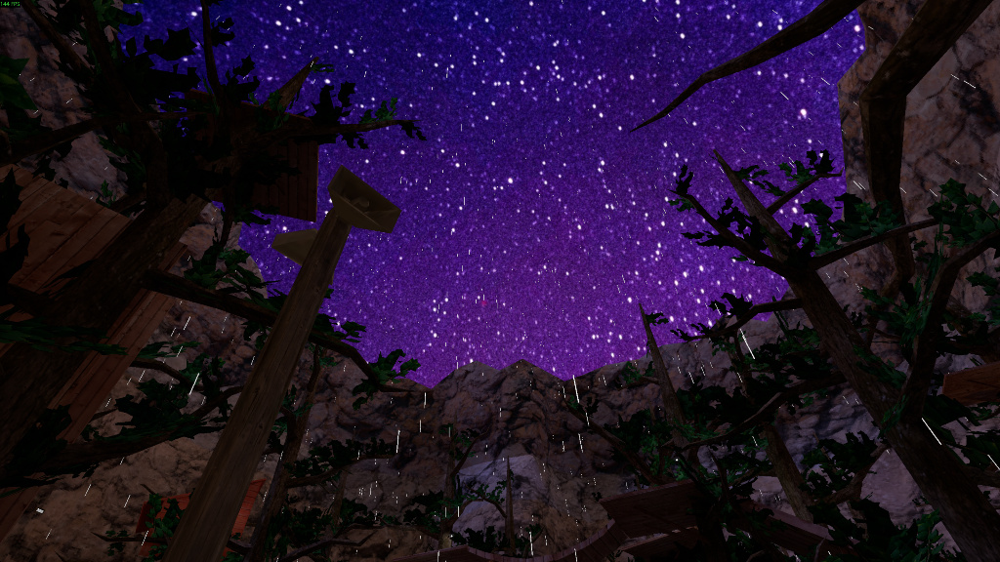

# Custom Sky
This mod allows you to replace the sky textures. 

## Installation
1. Ensure you have BepInEx 5 installed.
2. Drag and drop the mod into your plugins folder.
   
## Usage
1. **Launch the game once** to generate the necessary folders.  This will export the default sky textures into `./SkyboxExport` and create a `./CustomSkies` folder.
2. Place your replacement textures into the `./CustomSkies` folder.
   > **Important:** The file names in `./CustomSkies` must match the names of the original textures in `./SkyboxExport` exactly, or the mod will not load them.

## Disclaimer

This product is not affiliated with Another Axiom Inc. or its videogames Gorilla Tag and Orion Drift and is not endorsed or otherwise sponsored by Another Axiom.  
Portions of the materials contained herein are property of Another Axiom. ©2021 Another Axiom Inc.
